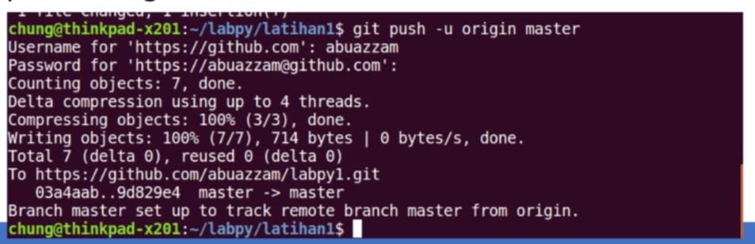

# CARA PENGGUNAAN GIT
## APA ITU GIT?
*Git adalah salah satu sistem pengontrol versi (Version Control System)
pada proyek perangkat lunak yang diciptakan oleh Linus Torvalds.

*Pengontrol versi bertugas mencatat setiap perubahan pada file
proyek yang dikerjakan oleh banyak orang maupun sendiri.

*Git dikenal juga dengan distributed revision control (VCS terdistribusi),
artinya penyimpanan database Git tidak hanya berada dalam satu
tempat saja.

## INSTALASI GIT

• Download Git, buka website resminya Git (git-scm.com).

• Kemudian unduh Git sesuai dengan arsitektur komputer kita. Kalau
menggunakan 64bit, unduh yang 64bit. Begitu juga kalau menggunakan 32bit.

• Selamat, Git sudah terinstal di Windows. Untuk mencobanya, silahkan
buka CMD atau PowerShell, kemudian ketik perintah

## MENAMBAHKAN GLOBAL CONFIG

• Pada saat pertama kali menggunakan git, perlu dilakukan konfigurasi
user.name dan user.email

• konfigurasi ini bisa dilakukan untuk global repostiry atau individual
repository.

• apabila belum dilakukan konfigurasi, akan mengakibatkan terjadi kegagalan
saat menjalankan perintah git commit

### Config Global Repository

## PERINTAH DASAR GIT

• git init, perintah untuk membuat repository local

• git add, perintah untuk menambahkan file baru, atau perubahan pada file
pada staging sebelum proses commit.

• git commit, perintah untuk menyimpan perubahan kedalam database git.

• git push -u origin master, perintah untuk mengirim perubahan pada
repository local menuju server repository.

• git clone [url], perintah untuk membuat working directory yang diambil dari
repositry sever.

• git remote add origin [url], perintah untuk menambahkan remote
server/repository server pada local repositry (working directory)

• git pull, perintah untuk mengambil/mendownload perubahan terbaru dari
server repository ke local repository

## Membuat Reposiory Local

• Buka direktory aktif, misal: d:\labs_pemrograman1 (buka
menggunakan Windows Explorer)

• klik kanan pada direktory aktif tersebut, dan pilih menu Git Bash,
sehingga muncul git bash commad

• Buat direktory project praktikum pertama dengan nama latihan1

• Sehingga terbentuk satu direktori baru dibawahnya, selanjutnya
masuk kedalam direktori tersebut dengan perintah cd (change
directory)

• direktory aktif menjadi: d:\labs_pemrograman1\latihan1

## Membuat Reposiory Local

• Jalankan perintah git init, untuk membuat repository local.

• Repository baru berhasil di inisialisasi, dengan terbentuknya satu
direktori hidden dengan nama .git

• Pada direktori tersebut, semua perubahan pada working directory
akan disimpan.

## Menambahkan File baru pada repository

• Untuk membuat file dapat menggunakan text editor, lalu menyimpan
filenya pada direktori aktif (repository)

• disini kita akan coba buat satu file bernama README.md (text file)

• File README.md berhasil dibuat.

## Menambahkan File baru pada repository

• Untuk menambahkan file yang baru saja dibuat tersebut gunakan
perintah git add.

• File README.md berhasil ditambahkan.

## Commit (Menyimpan perubahan ke database)

• Untuk menyimpan perubahan yang ada kedalam database repository
local, gunakan perintah git commit -m “komentar commit”

## Membuat repository server

• Server reopsitory yang akan kita gunakan adalah http://github.com
• Anda harus membuat akun terlebih dahulu.

• Pada laman github, klik tombol start a project, atau

• Dari menu (icon +) klik New Repository

## Membuat repository server

• Isi nama repositorynya, misal: labpy1.

• lalu klik tombol Create repository

## Menambahkan Remote Repository

• Remote Repository merupakan repository server yang akan
digunakan untuk menyimpan setiap perubahan pada local repository,
sehingga dapat diakses oleh banyak user.

• Untuk menambahkan remote repository server, gunakan perintah
git remote add origin [url]

## Push (Mengirim perubahan ke server)

• Untuk mengirim perubahan pada local repository ke server gunakan
perintah git push.

• Perintah ini akan meminta memasukkan username dan password
pada akun github.com

## Melihat hasilnya pada server repository

• Buka laman github.com, arahkan pada repositorinya.

• Maka perubahan akan terlihat pada laman tersebut.

## Clone Repository

• Clone repository, pada dasarnya adalah meng-copy repository server
dan secara otomatis membuat satu direktory sesuai dengan nama
repositorynya (working directory).

• Untuk melakukan cloning, gunakan perintah git clone [url]

## Kegunaan file README.md

• Apabila kita menggunakan github, untuk memberikan penjelasan
awal pada project yang kita buat, maka dapat menggunakan sebuah
file yang bernama README.md

• Pada file tersebut kita dapat membuat dokumentasi awal dari setiap
project yang kita buat untuk memberikan penjelasan atau sekedar
cara penggunaan dari aplikasi yang kita kembangkan.

• Penulisan file README.md berbasis teks, dan untuk pemformatannya
menggunakan Markdown format.

• untuk lebih jelasnya, dapat anda pelajari cara penggunaan markdown

 ## SEKIAN DAN TERIMA KASIH

[def]: screenshot/1.jpg